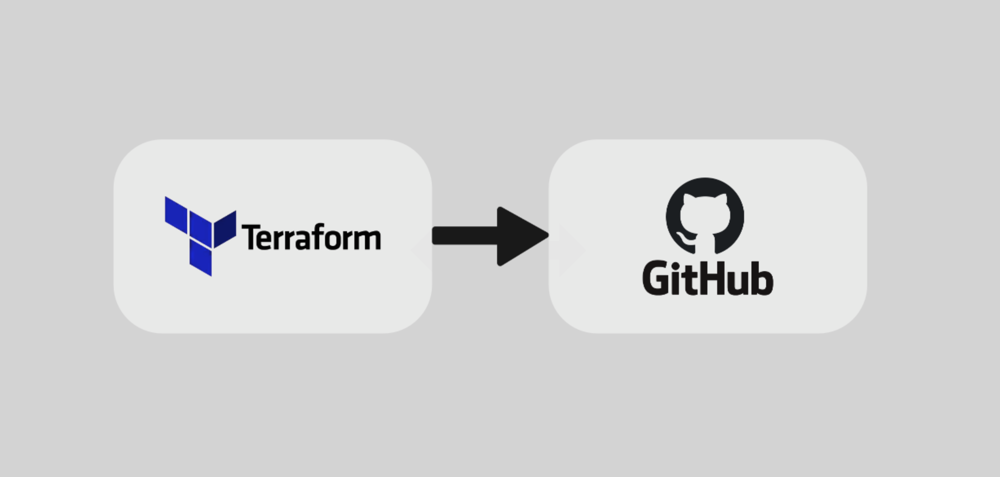

# Blog

I write about secure infrastructure, Kubernetes security, detection engineering, the practical lessons learned while building and defending cloud-native systems, and much more.

  

    <h3>DevSecOps</h3>
    
Secure pipelines, automation, and engineering practices that reduce risk without slowing teams down.

  

  

    <h3>Cloud</h3>
    
Patterns for reliable, observable, and resilient distributed systems in the cloud.

  

  

    <h3>More...</h3>
    
Books I've read, projects I'm working on, and even situations from my day-to-day life

  

## Posts

  

    
    

      
24 August 2026

      <h3 style="margin:0 0 0.5rem; font-size:1.1rem; line-height:1.4;">Terraform GitHub repository bootstrap</h3>
      
A practical guide to automating the creation of secure GitHub repositories with Terraform and reusable defaults.

      <a href="posts/github-repository-bootstrap/" style="font-weight:600;">Read more →</a>
    

  

## Explore more

- [Research](../research/index.md)
- [Projects](../projects/index.md)
- [Skills](../skills/index.md)
