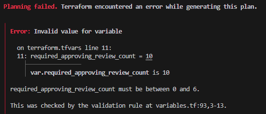

# GitHub repository bootstrap, part 2

Safer inputs, safer operations: what changed since the first version

## Context

In the [first post](./github-repository-bootstrap.md), I described a Terraform-based bootstrap that creates GitHub repositories with consistent defaults. Since then I have used it for real, and real usage exposed every rough edge: cryptic provider errors on bad inputs, no starting point for configuration, a `destroy` command one typo away from deleting a repository, and a CI pipeline testing an outdated Terraform version.

This post covers what I changed and why. No new concepts, just the hardening a tool needs once it leaves the demo stage.

## Safer inputs

The bootstrap now fails fast with clear messages instead of deep provider errors:

- every free-text variable is validated (no empty values, no spaces where GitHub forbids them)
- `repo_visibility` only accepts `public` or `private`
- `repo_description` is capped at GitHub's 350-character limit
- required approving reviews are configurable per project (`0`–`6`, default `0`)

Variable validation runs before Terraform touches the API, so a typo costs seconds, not a half-applied plan. A committed `terraform.tfvars.example` makes first setup a single copy command, while the real `tfvars` stays gitignored.

## Safer operations

Two changes protect the repositories once created:

- `terraform destroy` permanently deletes the GitHub repository. The README now says so explicitly, and an opt-in `lifecycle { prevent_destroy = true }` block is one uncomment away for projects that should never be deleted by accident.
- bootstrapping a second repository no longer fights local state. Reset scripts clear `terraform.tfstate` without touching GitHub, so created repositories are kept and the tool can move on to the next one.

Smaller touches in the same spirit: feature branches auto-delete on squash-merge, the token is typed through a hidden prompt instead of landing in shell history, and issue labels carry descriptions.

## Smoother workflow

The repository now enforces the habits it preaches. Every change goes through feature branches and pull requests with signed commits. CI runs format, validation, lint, and security scans, skips itself on docs-only pushes, cancels superseded runs, and shares its Checkov exceptions through a committed config so local runs match. Dependabot opens weekly update PRs for Actions and the provider, while the Terraform version pin moved to a tested 1.14.5.

## What I learned

Using the tool as its own development workflow taught me more than building it:

- validate at the boundary: Terraform variable validation catches mistakes before any API call, which is the cheapest place to fail
- local state means single purpose: a state file tracking one repository is simple and predictable, as long as the reset flow is documented
- guardrails beat warnings: a commented `prevent_destroy` block does more than a paragraph telling you to be careful
- CI should mirror local runs: shared configs (Checkov, formatting) remove the "works on my machine" gap
- signed commits and branch protection are friction until they save you once

## Why this matters in real teams

None of these changes make repository creation faster. They make it harder to do wrong: bad inputs rejected in seconds, destructive commands flagged before they run, dependencies updated through reviewable PRs instead of silent drift. That is the difference between a script that works and a tool a team can trust.

## Takeaways

The first version proved the idea; this iteration made it dependable. The pattern held up: small, explicit defaults, validated early, protected by default, automated where it counts.

## References

- Project repository: [https://github.com/isaiasvela/github-bootstrap](https://github.com/isaiasvela/github-bootstrap)
- Terraform GitHub provider documentation: [https://registry.terraform.io/providers/integrations/github/latest/docs](https://registry.terraform.io/providers/integrations/github/latest/docs)
- Terraform official documentation: [https://developer.hashicorp.com/terraform](https://developer.hashicorp.com/terraform)
- GitHub documentation: [https://docs.github.com/en](https://docs.github.com/en)