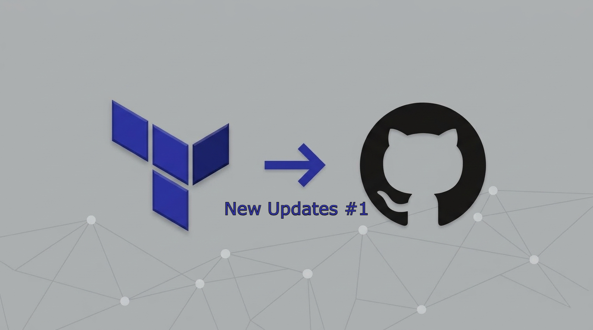
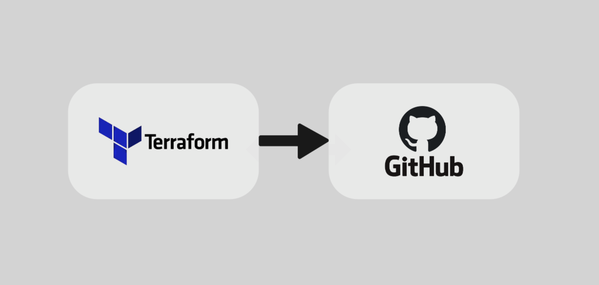

<i></i><i></i><i></i>

visitor@isaiasvela:~$ whoami

Isaías Vela — Ingeniero informático centrado en DevSecOps, seguridad en Kubernetes, cloud security y automatización de infraestructura.

visitor@isaiasvela:~$ cat mission.txt

Construyo, automatizo y aseguro infraestructura cloud-native. 

## Sobre mí

Me dedico a construir sistemas seguros que combinan ingeniería de software, automatización y resiliencia operativa. Trabajo en DevSecOps, cloud security, hardening de CI/CD e Infrastructure as Code para ayudar a los equipos a moverse rápido sin comprometer la seguridad.

### Áreas de experiencia

DevSecOps
Cloud Security
Kubernetes Security
Secure CI/CD
Security Automation
Infrastructure as Code

### Enfoque actual

Estoy buscando activamente oportunidades como:

- DevSecOps Engineer
- Cloud Security Engineer
- Cybersecurity Engineer

[Ver CV completo →](cv.md)

## Proyectos destacados

Kubernetes

### [Kubernetes Security Lab](projects/kubernetes-security-lab.md)

Laboratorio de seguridad hands-on centrado en hardening de Kubernetes, detección en runtime y simulación de ataques.

[Ver proyecto →](projects/kubernetes-security-lab.md)

Terraform

### [GitHub Bootstrap](projects/github-bootstrap.md)

Automatización reutilizable para crear repositorios seguros y flujos de trabajo de desarrollo.

[Ver proyecto →](projects/github-bootstrap.md)

Next.js

### [TimeTrack](projects/timetrack.md)

Aplicación de registro de jornada para dar soporte a la productividad y la visibilidad operativa.

[Ver proyecto →](projects/timetrack.md)

[Ver todos →](projects/index.md)

## Últimos writeups de seguridad

Super easy

### [Acme](writeups/writeups/acme.md)

De recon a root: banner SSH mal configurado y escalada con setuid.

[Ver writeup →](writeups/writeups/acme.md)

Super easy

### [Obsession](writeups/writeups/obsession.md)

FTP anonymous, fuerza bruta SSH y escalada con vim.

[Ver writeup →](writeups/writeups/obsession.md)

Super easy

### [Trust](writeups/writeups/trust.md)

Un laboratorio ofensivo sobre confianza mal puesta y misconfigurations.

[Ver writeup →](writeups/writeups/trust.md)

[Ver todos →](writeups/index.md)

## Últimas publicaciones

30 de septiembre de 2026

### Bootstrap de repositorios GitHub, parte 2: de demo a dependable

De demo funcional a herramienta dependable: inputs fail-fast, guardrails de destroy y un workflow a juego.

[Leer más →](blog/posts/github-repository-bootstrap-part2.md)

24 de agosto de 2026

### Bootstrap de repositorios GitHub con Terraform

Guía práctica para automatizar la creación de repositorios GitHub seguros con Terraform y defaults reutilizables.

[Leer más →](blog/posts/github-repository-bootstrap.md)

[Ver todos →](blog/index.md)

## Áreas de interés

- DevSecOps e ingeniería segura
- Cloud y seguridad en Kubernetes
- CI/CD seguro y policy enforcement
- Automatización e IaC para infraestructuras resilientes

---

> Este portfolio refleja ingeniería de seguridad práctica, arquitectura segura y mejora continua de sistemas cloud-native.
